# [Read the Developer Guide - iRoopDeepFaceCam: A Deep Dive into Face Swapping](https://github.com/iVideoGameBoss/iRoopDeepFaceCam/wiki)

# iRoopDeepFaceCam 
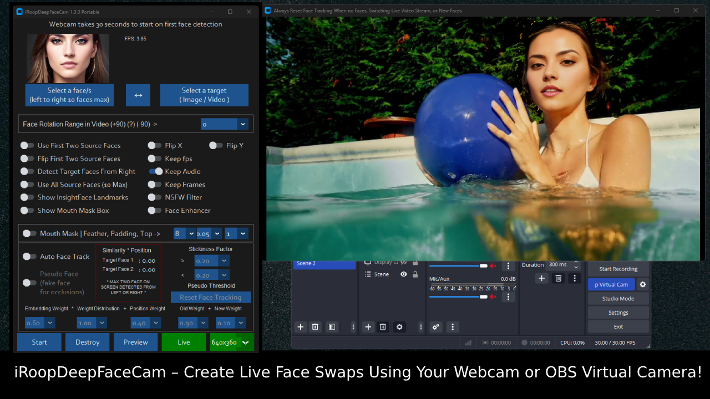

Get ready to dive into a whole new world of fun with iRoopDeepFaceCam! This innovative tool, inspired by the original [roop](https://github.com/s0md3v/roop) lets you create face swaps using a live webcam, video, or image file. Want to make it even more exciting? Use an OBS virtual camera to act as your webcam! 

iRoopDeepFaceCam features are groundbreaking that [Deep-Live-Cam](https://github.com/hacksider/Deep-Live-Cam) is now adding them to thier code such as our amazing Mouth Mask feature and more. iRoopDeepFaceCam has changed the world of face swap forever that no other app could do.

What sets iRoopDeepFaceCam apart is its ability to work with one or ten source faces and target one or 10 faces in real-time or in any video or image. Plus, the unique 'Mouth Mask' feature seamlessly blends the original mouth with the source face, allowing you to interact with objects and make your face swaps look incredibly realistic.

But that's not all! iRoopDeepFaceCam also offers face tracking for one to ten faces, perfect for keeping the magic alive when more people are on screen or when the scene changes. You can face swap one to ten people simultaneously, watch videos, or live stream with this fantastic feature. With all these powerful tools, iRoopDeepFaceCam opens up endless possibilities for creativity and fun. Dive in and start creating your own face swap adventures today!

### Click Image to Watch Quick Video Demo [iRoopDeepFaceCam](https://youtu.be/bhFx6fZab1E)
[](https://youtu.be/bhFx6fZab1E)

## Live Webcam Buttons

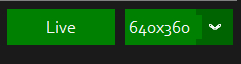

To kick off the Live webcam feature in iRoopDeepFaceCam, just hit the 'Live' button. It takes about 30 seconds for the preview window to pop up. You can adjust the resolution of the live webcam to suit your needs, but keep in mind that higher resolutions may slow down the face swap process. Feel free to switch resolutions based on your computer's power and performance.

No worries about the preview window size—you can resize it independently of the webcam resolution. Want to go full screen? You can make the preview window as large as you like without affecting the face swap rendering. The rendering will stay smooth, no matter the size of your preview window. Enjoy seamless face swap fun with complete control over your setup!  

Webcam resolution can also control the quality of filters, like White Ink, Black Ink and Pencil. Low resolution will give you thicker lines, and higer resolution will give you thinner lines.

## One to Ten faces replaced on webcam

(watch this video to see how Two faces can be swapped)


Watch as a live webcam feed transforms into an incredible face swap before your eyes! You’ll see the magic happen in real-time, with the face swap capturing every detail — even light reflections on the face move naturally, making the transformation look unbelievably lifelike. It's not just a face swap; it's like watching reality blend seamlessly with creativity!

Why settle for face swapping just one face when you can 10x the fun? With iRoopDeepFaceCam, you can use a source file with One to Ten faces to face swap One to Ten people live on a webcam feed, video, or image. Imagine the endless possibilities for creating hilarious and entertaining YouTube videos—you and your partners can transform into anyone you want!

Take it up a notch by using OBS virtual webcam on livestreams, and watch as you create live face swaps in real-time. There's no extra processing needed, so you can instantly make yourself appear in streams! With iRoopDeepFaceCam, the power to create amazing, fun, and engaging content is right at your fingertips. The only limit is your imagination!

## Supports processing of an image or video file with One to Ten faces plus mouth mask and face tracking on videos

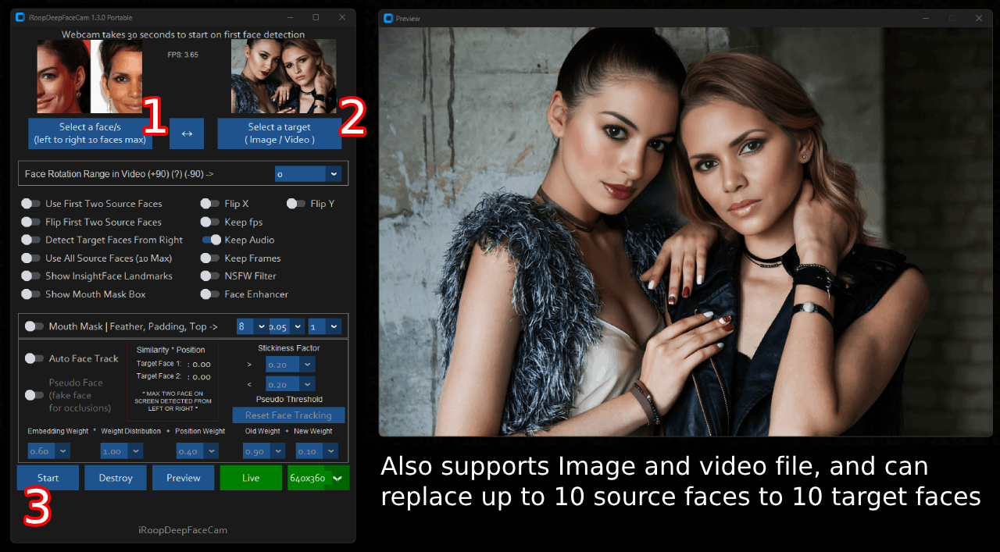

With iRoopDeepFaceCam, you can process an image or video file with One to Ten faces, using advanced features like mouth mask feature for an ultra-realistic effect. Here’s how easy it is to get started: simply choose a source image with the desired faces, select a target image or video where you want to replace the faces, and hit Start.

Then, just open your file explorer and navigate to the directory where you want your output to be saved. You'll see a folder named after your video title, where you can watch the frames being swapped in real-time! Once the processing is complete, your final output file will be ready to go. It's that simple—no complicated steps, just straightforward face swap magic!

## Mouth Mask mode allows you to interact with objects live via webcam, video or image

(watch this video to see how Mouth Mask works)

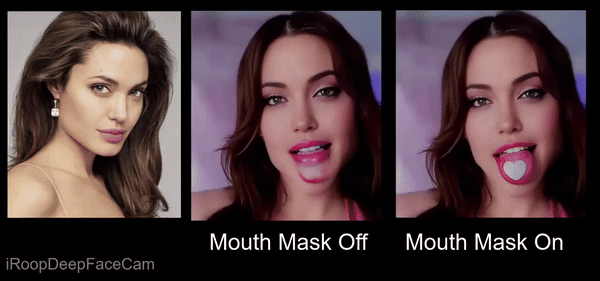

You can also enable Mouth Mask to process a video file or an image

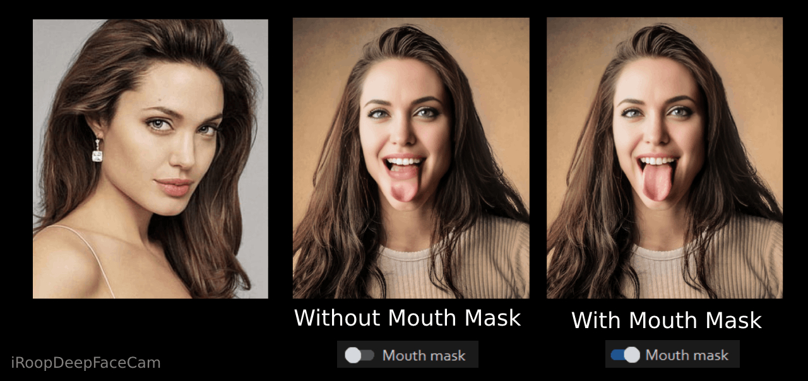

With Mouth Mask mode in iRoopDeepFaceCam, you can interact with objects live via a webcam, video, or image, creating a seamless blend with the face swap. Imagine your face being face swapped while eating, drinking, or talking — this groundbreaking technique lets you fully enjoy the magic of interactive face swaps!

What’s truly incredible about this feature is its ability to work in real-time with your webcam, giving you complete control over the Mouth Mask to place it exactly where you want it. Whether you're creating fun content or experimenting with new ideas, this real-time capability makes it super easy and entertaining to explore. Plus, when you pair it with OBS virtual camera, it takes the fun to a whole new level, allowing you to bring your face swaps to life in live streams like never before. Dive in and experience the thrill!

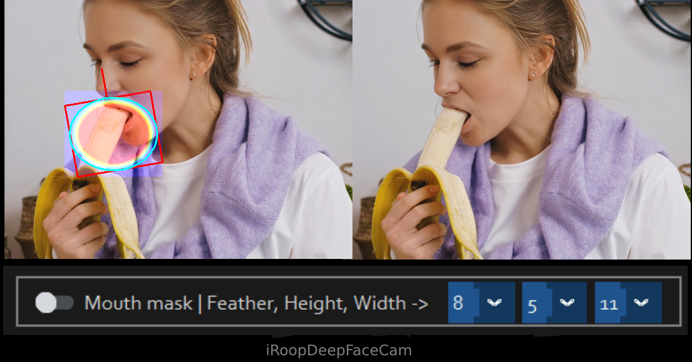

## Auto One to Ten Face Tracking (Max Ten people in frame)

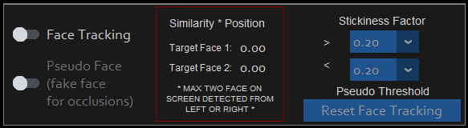

(watch this video to see how Two faces tracking works)


Auto One to Ten Face Tracking in iRoopDeepFaceCam takes your face swap experience to the next level! With this feature, you can track up to one to ten people in a frame on either a webcam or video file. The software automatically detects target faces from the left side of the frame and assigns up to ten source faces to ten target faces. This feature shines when all the people are in the frame, allowing you to face swap and track One to Ten faces with ease.

Need to switch things up? You can reset face tracking at any time, with two face tracking you can switch sides, flip faces, or even detect faces from the right side of the screen. This works best with two faces. All these breakthrough features, combined with Mouth Mask mode, are incredibly powerful. It seamlessly tracks one to ten people, even when the camera angle changes or the scene shifts, letting them interact naturally and even switch sides in the room. With iRoopDeepFaceCam's face tracking, you'll always know where the person is, making for a smooth and dynamic face swap experience!

## How Auto Face Tracking Works in iRoopDeepFaceCam

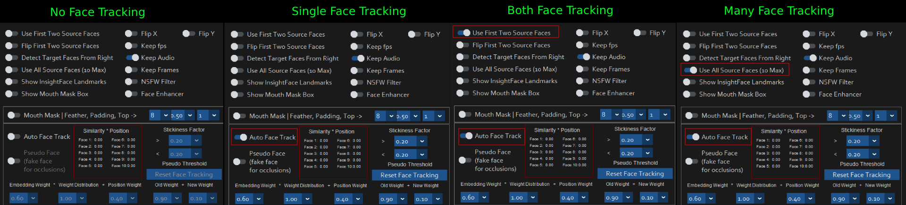

iRoopDeepFaceCam's auto face tracking feature leverages advanced Artificial Intelligence (A.I.) to create a dynamic and accurate face swapping experience. Imagine teaching a sophisticated robot to recognize and follow faces in real-time—that's essentially what's happening. The system identifies and "memorizes" faces in your target video or webcam, then tracks them as they move, ensuring a consistent and engaging face-swap.

The core idea is to use AI to analyze faces and their positions within a frame (video, webcam) and then accurately map them to faces in your source image(s). This mapping enables the face swapping to occur on the correct target faces, even if those faces change position over time. This feature is automatically enabled when you turn on the 'Auto Face Track' switch.

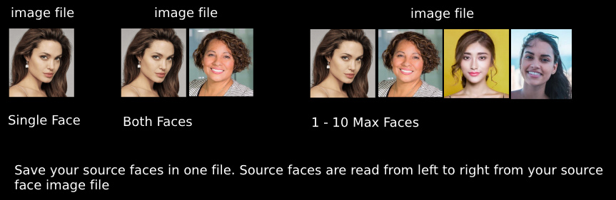

**You don't have to always use face tracking.** If your webcam or video displays people who will not change their positions, then using face tracking is unnecessary. You should use face tracking only if people will be moving around and changing positions.

# How Face Index Option on Live Cam Preview Window Works:

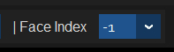

The Face Index dropdown allows you to select a specific face for single-face swapping. It is designed exclusively for single-face swapping and will override both the "Use Fist Two Source Faces" and "Use All Source Faces (10 Max)" options. When you choose a source image containing up to ten faces, this dropdown will automatically populate, enabling you to select the desired face for single face swapping. A value of -1 indicates the use of the automatic face selection system for "Use Fist Two Source Faces" and "Use All Source Faces (10 Max)" modes. When Ever you turn on these two options the Face Index is always set back to -1.

When you enable "Use All Source Faces (10 Max)", the Face Index is automatically reset to -1. You can then adjust the Face Index to a specific value, and the selected face will be used to swap all detected faces in the target frame with the chosen face.

This option is particularly useful for handling scenarios where faces may appear in reflections, mirrors, or photos in the background. Using this feature ensures that the intended face is consistently swapped, avoiding errors caused by the AI detecting false positives. For example, the AI might mistakenly identify a tiny cluster of pixels as a face, which could result in swapping an unintended area instead of the desired face.

By enabling "Use All Source Faces (10 Max)" first and then setting the Face Index to the specific face you want, you ensure that all detected faces in the frame are swapped with your selected face. This is especially helpful if you notice glitches or inconsistencies in certain frames, as they often occur when the AI detects unintended faces in the scene.

When you enable 'Auto Face Track', the Face Index is automatically set to -1. You can adjust the Face Index afterward to specify the face you want to track. We are again talking about single face tracking here cause the Face Index options is meant to be used for one specific face that will be swapped for Live Cam Mode.


# How Face Tracking Works Step-by-Step:

1.  **Initial Face Detection and Embedding:**

    *   When you initiate face tracking (either by starting the feature or by clicking the 'Reset Face Tracking' button), iRoopDeepFaceCam's A.I. analyzes the faces it sees at that moment. This initial detection is crucial because it forms the basis for all subsequent tracking.
    *   The A.I. doesn't just see faces; it generates a unique *embedding* for each face. Think of an embedding as a unique digital fingerprint that captures the facial features' essential characteristics (shape, structure, textures). This embedding is a numerical representation of what the face looks like.
    *   The faces detected at the start are ordered from left to right that are found for each frame, and mapped to tracked locations, e.g., Face 1, Face 2, Face 3 and so on are tracked separately. These locations are the same positions that source faces are matched to when face swapping. You source images in this example would have Face 1, Face 2, Face 3 also. Its a one to one match.

    *   **Important Considerations:**
        *   All faces you want to track *must* be clearly visible and unobstructed when you start face tracking. This is how the system initially memorizes their unique features.
        *   If the face has hair in front of it and is moving around where the face keeps hiding the the face detection score will be low, you will see flickering. You can Reset Face Tracking to try to capture a good face for a few frames. But these types of constant face hiding is not ideal.
        *   If a person walks into the frame later, they won't be automatically tracked unless you reset the tracking. 
        *   For webcam use, make sure all desired participants are within view of the camera before activating tracking.
        *   For video files, the tracking works best if the participants are visible at the beginning of the video.
        *   In the middle of swapping a video, clicking the 'Reset Face Tracking' button will not reset the face tracking. You would have to do this before you click the 'Start' button.

2.  **Tracking the Faces:**
    *   The face tracking system then uses the embeddings and positions to track faces in real time or in the video once it has had a chance to see the faces at the start.
    *   The system continuously compares the embedding and position of new detected faces with the embeddings of those it's already tracking.
    *   It uses a combination of techniques like a weighted average for the position and embedding to make the tracking smooth and prevent flickering and still be accurate when the faces switch position.
    *   The system also boosts the score of the faces that have the same ID to prevent it from swapping to a different face unless the match score is very low.

### How Face Tracking Works (1 to 10 Faces)

iRoopDeepFaceCam offers flexible face tracking options:

*   **Single Face Tracking:**
    *   When a single face is detected in the source image, iRoopDeepFaceCam is set up to track the leftmost face seen in target video or webcam, even if other faces are present in the scene. The first left face found in target will be used.
    *   This single face tracking mode does not require more than one source face. It does not matter how many faces are in source image, by default only the first face found from left in source image is used.
    *   The system will follow the target face around, even if it changes positions with other faces in the frame. This is only possible with face tracking.
    *   To use this you do not need to click any other buttons just click 'Auto Face Track' switch.

*   **Two Face Tracking:**
    *   With a source image containing two faces, iRoopDeepFaceCam tracks the two leftmost faces in target frame.
    *   Like single face tracking, it is not limited to only two faces in a frame, but only the two most left faces will be tracked.
    *   If those two people move and change positions, the system will still accurately track them.
    *   To use this make sure 'Both Faces' is selected and then click on 'Auto Face Track'

*   **1 to 10 Face Tracking (Multi-Face Tracking):**
    *   When you enable the 'Use All Source Faces (10 Max)' button, the system is set up to track up to 10 faces in the target frame with up to 10 source faces that you provide.
    *   The system will track faces from left to right using 1 to 10 source faces.
    *   It is ideal to have the same number of target faces and source faces for the best performance. For example, if you have 4 source faces you should have 4 people in the frame max.
   *   If you provide less then 10 source faces and have more faces in the video or webcam then the source image, then you can see faces jumping to these new faces on occlusions of tracked faces.
   *   In the same way if you have less then 10 faces in the video or webcam and you provide more source faces, then the system will only track using the number of source faces it has, you can see new faces souce faces jumping on occlusions of tracked faces.
   *   It is best to keep the max number of source and target faces matched.

### What happens if the faces are blocked or covered

*   If the tracked faces get blocked for too long, the system may loose track of them. If this happens you should reset the face tracking. 
*   To stop the system from "flickering" when there is a small obstruction in front of the face like hair when starting to track. The system does not always perform a face swap if the score is too low. If a tracked face is missing for too long the system will generate a fake face at the last known location when pesudo is on and perform a face swap with that fake face.

### Resetting Face Tracking

*   If you think the tracking has become inaccurate, you can always click on the `Reset Face Tracking` button, this will clear all of the tracked data and start tracking faces again. The new tracked faces will start from the left of the frame.
*   When using videos you can only reset the face tracking when you load the video. You can not reset the face tracking in the middle of a video being processed. 

### Video Specifics

*   For video files, ensure that all faces you intend to track are clearly visible for a short period at the start of the video. This enables the A.I. to properly establish its initial tracking targets and their facial embeddings.

### Webcam Specifics

*   When using a live webcam, arrange the participants so that the desired faces are visible before starting face tracking. You can also click 'Reset Face Tracking' to start again. When you are using OBS webcam you can find a frame in the video when all faces are present and click on 'Reset Face Tracking' to start again.

### Why Proper Setup is Important

The quality of face tracking is heavily reliant on the clarity and consistency of the initial face information. When a face is occluded or missing, the system can become confused, making it difficult to maintain accurate tracking. By following these simple guidelines, you'll maximize the effectiveness of the auto face tracking system.

If your subjects are going to be moving too much on screen where the heads are turning and too close to each other then the face tracking is not going to work very good. This is due to how faces are tracked based on position on a vertical line. If two faces are switching faces places on the veritcal line too many time due to being to close then the face tracking will get confused.

### You don't have to always use face tracking

If your webcam or video is showing people who will never move from their positions, then it is pointless to use face tracking. You want to use face tracking if people are switching positions. 

Also for example if you have lets say less source faces and more target faces and you enable, 'Use All Source Faces (10)' without auto tracking, then the sources faces will just repeat.

### Face Tracking Settings

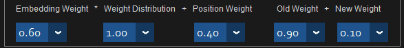

EMBEDDING WEIGHT:

This is like how much importance we give to the face's unique features. Imagine each face has a special "fingerprint". This number tells us how much we care about matching these "fingerprints" when we're trying to track a face from one frame to the next.

WEIGHT DISTRUBUTION:

This is a way to adjust how much we care about the face's features compared to its position. If it's bigger, we care more about the features. If it's smaller, we care more about the position.

POSITION WEIGHT:

This is how much we care about where the face is in the picture. If a face doesn't move much between frames, it's probably the same face, right? This number tells us how important we think that is.

OLD WEIGHT and NEW WEIGHT:

When we're tracking a face over time, we don't want to forget what it looked like before, but we also want to update our idea of what it looks like now. OLD_WEIGHT is how much we remember about the face from before, and NEW_WEIGHT is how much we pay attention to what it looks like right now.

How To Use Face Track Settings:

iRoopDeepFaceCam is designed to track and swap faces with either one or two faces in focus. When swapping just one face, you can have more than two people on screen, and the tracked face should stay locked on the individual, no matter where they move. However, when swapping two faces, it's crucial to have only two people on screen for optimal face tracking. If there are more than two people, the third person should avoid crossing into the tracked individuals’ areas, as their face may unintentionally get swapped.

Face detection occurs from either the left or right side of the frame. When tracking two faces, the first two detected on the left can switch sides, and the same applies for faces detected on the right. If there are more than two people, and multiple faces start switching sides, the face swap may become unstable, causing the swap to jump unexpectedly, as the system expects faces to be detected from either the left or right of the screen.

Finding the right balance of people on screen and tracking conditions may require some trial and error to determine what works best for your situation!

## Face Rotation Range in Video 

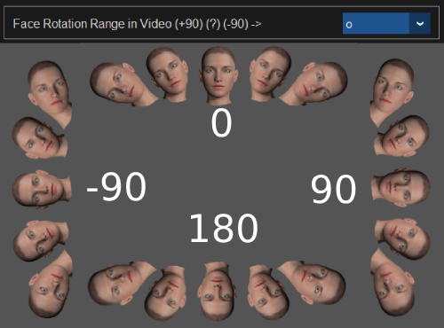

When swapping a face using the InsightFace A.I. in videos, images, or webcam feeds, the A.I. effectively handles face orientations within a specific range of angles: (-90°), (0°), and (+90°). If the face rotates beyond these angles, the A.I. may struggle to detect and process it accurately.

To manage extreme face orientations, you can utilize the rotation feature. For instance, if your subject is lying in bed with their face positioned horizontally, adjust the rotation range to either +90° or -90°, depending on the face's direction in the video. This ensures the face swap is applied correctly, even for unconventional orientations.

## How A.I. Face Swap Works and Key to Understanding InsightFace Rotations and its Limits (click image to watch video)

[](https://youtu.be/BzTqrIm69Ws?si=C4t7jL6CJ9JvdgX0)

### click image to watch video [Roop Deep Fake Course](https://youtu.be/BzTqrIm69Ws?si=C4t7jL6CJ9JvdgX0)


## How do I use it?
> Note: When you run this program for the first time, it will download some models ~300MB in size.

Executing `python run.py` command will launch this window:


## For the webcam mode

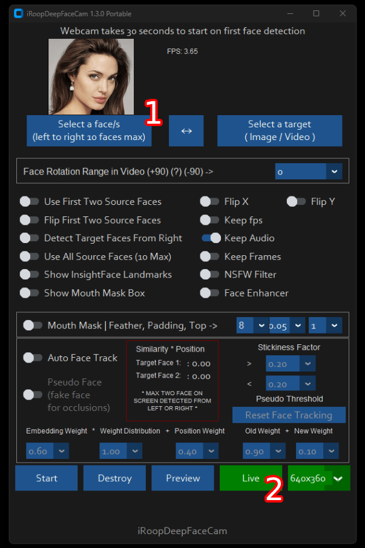

Here's how to get started with iRoopDeepFaceCam:
1. Select a Face: Choose an image with either one or two faces. The left face will be used as Face 1, and the right face will be used as Face 2.
2. Click Live: Hit the 'Live' button to start the live webcam feed.
3. Wait a Few Seconds: It may take 10 to 30 seconds for the preview window to appear, so hang tight as the system prepares.

And that's it! You're all set to start your deep fake adventure. Enjoy the show!


Just use your favorite screencapture to stream like OBS
> Note: In case you want to change your face, just select another picture, the preview mode will then restart (so just wait a bit).
> If you have more then one face in the source image from left to right, then you can use the Face Index dropdown on the Live Cam Preview window to switch source faces in realtime. This is for single face only.

## One/Two face controls for webcam mode, video or image
You can control how a face/s is replaced on target face\s

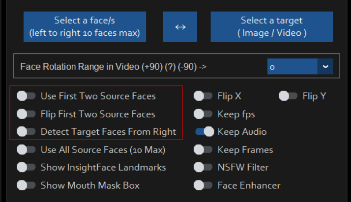

1. **Use First Two Source Faces**: Enable this option if your source image has two faces and you want to replace both faces in your webcam feed, video, or image. By default, the left face in the source image is "Face 1" and the right face is "Face 2". If a face goes out of the frame in your video, "Face 1" will be used. To switch which face is used, see the "Flip left/right faces" option below.

2. **Flip First Two Source Faces**: Turn this option on to swap the roles of the faces in your source image. The right face becomes "Face 1" and the left face becomes "Face 2". This is handy for swapping faces in your webcam feed, video, or image when you have one or two faces. 

3. **Detect Target Faces From Right**: Use this feature when you have one target face and the "Show both faces" option is off. By default, faces are detected from the left side of the webcam, video, or image. If you have background elements like a picture frame to the left of the person, this option helps by detecting and replacing "Face 2" first, then "Face 1". This allows you to control which detected face gets replaced first.

These features give you flexible control over your face swap creations, ensuring you get the results you want!

## Disclaimer
This software is meant to be a productive contribution to the rapidly growing AI-generated media industry. It will help artists with tasks such as animating a custom character or using the character as a model for clothing etc.

The developers of this software are aware of its possible unethical applications and are committed to take preventative measures against them. It has a built-in check which prevents the program from working on inappropriate media including but not limited to nudity, graphic content, sensitive material such as war footage etc. We will continue to develop this project in the positive direction while adhering to law and ethics. This project may be shut down or include watermarks on the output if requested by law.

Users of this software are expected to use this software responsibly while abiding by local laws. If the face of a real person is being used, users are required to get consent from the concerned person and clearly mention that it is a deepfake when posting content online. Developers of this software will not be responsible for actions of end-users.

## How do I install it?

### Basic: iRoopDeepFaceCam works fast on GPU. It is more likely to work on your computer fast on Nvidia GPU but it will also work on CPU but be very slow. You can follow instructions for the basic install (This usually runs via **CPU**). Go with an Nvidia GPU as it gives you the best results.

#### 1.Setup your platform
-   python (3.10 recommended)
-   pip
-   git
-   [ffmpeg](https://www.youtube.com/watch?v=OlNWCpFdVMA) 
-   [visual studio 2022 runtimes (windows)](https://visualstudio.microsoft.com/visual-cpp-build-tools/)

#### 2. Clone Repository
1. Clone the Repository:
    First, you need to clone the repository to your computer. For this example, we'll use a PC. You can either clone the repository directly to the root drive or into a specific folder of your choice.

2. Choosing a Location:
   You can clone the repository to the root of your C:\ drive or into a specific folder, like C:\iRoopDeepFaceCam. It’s up to your personal preference.
    - Open your command prompt or terminal.
    - Navigate to the root of the C:\ drive or the folder where you want to clone the repository.
        - To navigate to the root drive, you can use:
          
        ```cd C:\```
        - To navigate to a specific folder, folder must already exist. use:
        
        ```cd C:\iRoopDeepFaceCam```

    - Run the following command to clone the repository:

        ```git clone https://github.com/iVideoGameBoss/iRoopDeepFaceCam.git```

    If you cloned the repository to the root drive, it will be directly in C:. If you chose a specific folder, navigate to that folder first before running the clone command.

2. Navigate to the Cloned Repository:
   Once the repository has been cloned, you need to navigate into the iRoopDeepFaceCam folder.
    - If you cloned to the root drive, use:

       ```cd iRoopDeepFaceCam```
      
    - If you cloned into a specific folder (e.g., C:\iRoopDeepFaceCam), you would still use:

       ```cd iRoopDeepFaceCam```
        
Regardless of where you cloned the repository, ensure you navigate to the iRoopDeepFaceCam folder to proceed with further instructions.

#### 2. Download Models

 1. [GFPGANv1.4](https://huggingface.co/ivideogameboss/iroopdeepfacecam/blob/main/GFPGANv1.4.pth)
 2. [inswapper_128_fp16.onnx](https://huggingface.co/ivideogameboss/iroopdeepfacecam/blob/main/inswapper_128_fp16.onnx) *(Note: Use this [replacement version](https://github.com/facefusion/facefusion-assets/releases/download/models/inswapper_128_fp16.onnx) if an issue occurs on your computer)*

Then put those 2 files oi the "**models**" folder

#### 3. Setup VENV enviroment. We highly recommend to work with a  `venv`  to avoid issues.

1. Run each command line by line from the iRoopDeepFaceCam folder you navigated to from the instructinons above. This is the folder where you see all the files and folders from the clone.

   ```python -m venv venv```
      
   ```cd venv```
      
   ```cd Scripts```
      
   ```activate```
      
   ```cd..```
      
   ```cd..```
      
#### 4. Install dependency
Continuing from the instructions above, you will need to run the following command to install the necessary dependencies:
```
pip install -r requirements.txt
```
It's a good idea to run this command at least twice to ensure all components are installed correctly. Sometimes, running it multiple times may reveal additional files or dependencies that need to be in place for everything to be set up properly.

For MAC OS, You have to install or upgrade python-tk package:
```
brew install python-tk@3.10
```
#### 5. Run iRoopDeepFaceCam
Now you should be ready to run iRoopDeepFaceCam. 
```
python run.py --execution-provider cpu
```
##### DONE!!! If you dont have any GPU, You should be able to run roop using `python run.py` command. Keep in mind that while running the program for first time, it will download some models which can take time depending on your network connection.

Here's a quick tip, you can run the CPU or GPU like this. 

CPU
```
python run.py --execution-provider cpu
```

GPU - must have CUDA installed. Follow step 7
```
python run.py --execution-provider cuda --execution-threads 5
```

#### 6. Run iRoopDeepFaceCam again and again

You can also click on the bat files that make it easy to run again and again. 

run-cpu.bat

run-cuda.bat

To start iRoopDeepFaceCam again without using the batch file, you can use the command prompt instead shown below.

Here’s how to do it if you want to run it again. Using your command prompt go to the **iRoopDeepFaceCam** directory. Where you see run.py is the root directory. Using the command prompt type the following one line at a time.

```
cd venv

cd Scripts

activate

cd..

cd..

python run.py --execution-provider cpu

```

If you have a GPU then the last line would be
```
python run.py --execution-threads 5 --execution-provider cuda
```

#### 7. Proceed if you want to use GPU acceleration (optional)


### CUDA Execution Provider (Nvidia)*

1.  Install  [CUDA Toolkit 11.8](https://developer.nvidia.com/cuda-11-8-0-download-archive)
2.  Install dependencies:
```
pip uninstall onnxruntime onnxruntime-gpu
pip install onnxruntime-gpu==1.16.3
```

3.  Usage in case the provider is available:
```
python run.py --execution-provider cuda
```

### [](https://github.com/s0md3v/roop/wiki/2.-Acceleration#coreml-execution-provider-apple-silicon)CoreML Execution Provider (Apple Silicon)

1.  Install dependencies:

```
pip uninstall onnxruntime onnxruntime-silicon
pip install onnxruntime-silicon==1.13.1
```

2.  Usage in case the provider is available:
```
python run.py --execution-provider coreml
```

### [](https://github.com/s0md3v/roop/wiki/2.-Acceleration#coreml-execution-provider-apple-legacy)CoreML Execution Provider (Apple Legacy)

1.  Install dependencies:
```
pip uninstall onnxruntime onnxruntime-coreml
pip install onnxruntime-coreml==1.13.1
```

2.  Usage in case the provider is available:
```
python run.py --execution-provider coreml
```

### [](https://github.com/s0md3v/roop/wiki/2.-Acceleration#directml-execution-provider-windows)DirectML Execution Provider (Windows)

1.  Install dependencies:
```
pip uninstall onnxruntime onnxruntime-directml
pip install onnxruntime-directml==1.15.1
```

2.  Usage in case the provider is available:
```
python run.py --execution-provider directml
```

### [](https://github.com/s0md3v/roop/wiki/2.-Acceleration#openvino-execution-provider-intel)OpenVINO™ Execution Provider (Intel)

1.  Install dependencies:
```
pip uninstall onnxruntime onnxruntime-openvino
pip install onnxruntime-openvino==1.15.0
```

2.  Usage in case the provider is available:
```
python run.py --execution-provider openvino
```


Additional command line arguments are given below. To learn out what they do, check [this guide](https://github.com/s0md3v/roop/wiki/Advanced-Options).

```
options:
  -h, --help                                               show this help message and exit
  -s SOURCE_PATH, --source SOURCE_PATH                     select a source image
  -t TARGET_PATH, --target TARGET_PATH                     select a target image or video
  -o OUTPUT_PATH, --output OUTPUT_PATH                     select output file or directory
  --frame-processor FRAME_PROCESSOR [FRAME_PROCESSOR ...]  frame processors (choices: face_swapper, face_enhancer, ...)
  --keep-fps                                               keep original fps
  --keep-audio                                             keep original audio
  --keep-frames                                            keep temporary frames
  --many-faces                                             process every face
  --both-faces                                             use two faces in source image
  --flip-faces                                             flip two faces in source image from right to left
  --detect-face-right                                      detect target face from right of frame
  --show-target-face-box                                   show target face box
  --mouth-mask                                             show target mouth using mask
  --show-mouth-mask-box                                    show mouth mask box
  --face-tracking                                          track one or two faces when two people are in frame. Max two faces tracked
  --nsfw-filter                                            filter the NSFW image or video
  --video-encoder {libx264,libx265,libvpx-vp9}             adjust output video encoder
  --video-quality [0-51]                                   adjust output video quality
  --live-mirror                                            the live camera display as you see it in the front-facing camera frame
  --live-resizable                                         the live camera frame is resizable
  --max-memory MAX_MEMORY                                  maximum amount of RAM in GB
  --execution-provider {cpu} [{cpu} ...]                   available execution provider (choices: cpu, ...)
  --execution-threads EXECUTION_THREADS                    number of execution threads
  -v, --version                                            show program's version number and exit
```

Looking for a CLI mode? Using the -s/--source argument will make the run program in cli mode.

### Webcam mode on Windows 11 using WSL2 Ubuntu (optional)

<details>
<summary>Click to see the details</summary>

If you want to use WSL2 on Windows 11 you will notice, that Ubuntu WSL2 doesn't come with USB-Webcam support in the Kernel. You need to do two things: Compile the Kernel with the right modules integrated and forward your USB Webcam from Windows to Ubuntu with the usbipd app. Here are detailed Steps:

This tutorial will guide you through the process of setting up WSL2 Ubuntu with USB webcam support, rebuilding the kernel, and preparing the environment for the Deep-Live-Cam project.  
  
#### 1. Install WSL2 Ubuntu  
  
Install WSL2 Ubuntu from the Microsoft Store or using PowerShell:  
  
#### 2. Enable USB Support in WSL2  
  
1. Install the USB/IP tool for Windows:  
[https://learn.microsoft.com/en-us/windows/wsl/connect-usb](https://learn.microsoft.com/en-us/windows/wsl/connect-usb)  
  
2. In Windows PowerShell (as Administrator), connect your webcam to WSL:  
  
```powershell  
usbipd list  
usbipd bind --busid x-x # Replace x-x with your webcam's bus ID  
usbipd attach --wsl --busid x-x # Replace x-x with your webcam's bus ID  
```  
 You need to redo the above every time you reboot wsl or re-connect your webcam/usb device.
 
#### 3. Rebuild WSL2 Ubuntu Kernel with USB and Webcam Modules  
  
Follow these steps to rebuild the kernel:  
  
1. Start with this guide: [https://github.com/PINTO0309/wsl2_linux_kernel_usbcam_enable_conf](https://github.com/PINTO0309/wsl2_linux_kernel_usbcam_enable_conf)  
  
2. When you reach the `sudo wget [github.com](http://github.com/)...PINTO0309` step, which won't work for newer kernel versions, follow this video instead or alternatively follow the video tutorial from the beginning: 
[https://www.youtube.com/watch?v=t_YnACEPmrM](https://www.youtube.com/watch?v=t_YnACEPmrM)  
  
Additional info: [https://askubuntu.com/questions/1413377/camera-not-working-in-cheese-in-wsl2](https://askubuntu.com/questions/1413377/camera-not-working-in-cheese-in-wsl2)  
  
3. After rebuilding, restart WSL with the new kernel. 
  
#### 4. Set Up Deep-Live-Cam Project  
 Within Ubuntu:
1. Clone the repository:  
  
```bash  
git clone https://github.com/iVideoGameBoss/iRoopDeepFaceCam.git
```  

2. Follow the installation instructions in the repository, including cuda toolkit 11.8, make 100% sure it's not cuda toolkit 12.x.  
   
#### 5. Verify and Load Kernel Modules  
  
1. Check if USB and webcam modules are built into the kernel:  
  
```bash  
zcat /proc/config.gz | grep -i "CONFIG_USB_VIDEO_CLASS"  
```  
  
2. If modules are loadable (m), not built-in (y), check if the file exists:  
  
```bash  
ls /lib/modules/$(uname -r)/kernel/drivers/media/usb/uvc/  
```  
  
3. Load the module and check for errors (optional if built-in):  
  
```bash  
sudo modprobe uvcvideo  
dmesg | tail  
```  
  
4. Verify video devices:  
  
```bash  
sudo ls -al /dev/video*  
```  
  
#### 6. Set Up Permissions  
  
1. Add user to video group and set permissions:  
  
```bash  
sudo usermod -a -G video $USER  
sudo chgrp video /dev/video0 /dev/video1  
sudo chmod 660 /dev/video0 /dev/video1  
```  
  
2. Create a udev rule for permanent permissions:  
  
```bash  
sudo nano /etc/udev/rules.d/81-webcam.rules  
```  
  
Add this content:  
  
```  
KERNEL=="video[0-9]*", GROUP="video", MODE="0660"  
```  
  
3. Reload udev rules:  
  
```bash  
sudo udevadm control --reload-rules && sudo udevadm trigger  
```  
  
4. Log out and log back into your WSL session.  
  
5. Start Deep-Live-Cam with `python run.py --execution-provider cuda --max-memory 8` where 8 can be changed to the number of GB VRAM of your GPU has, minus 1-2GB. If you have a RTX3080 with 10GB I suggest adding 8GB. Leave some left for Windows.

#### Final Notes  
  
- Steps 6 and 7 may be optional if the modules are built into the kernel and permissions are already set correctly.  
- Always ensure you're using compatible versions of CUDA, ONNX, and other dependencies.  
- If issues persist, consider checking the Deep-Live-Cam project's specific requirements and troubleshooting steps.  
  
By following these steps, you should have a WSL2 Ubuntu environment with USB webcam support ready for the Deep-Live-Cam project. If you encounter any issues, refer back to the specific error messages and troubleshooting steps provided.

#### Troubleshooting CUDA Issues  

If you encounter this error:  
  
```  
[ONNXRuntimeError] : 1 : FAIL : Failed to load library [libonnxruntime_providers_cuda.so](http://libonnxruntime_providers_cuda.so/) with error: libcufft.so.10: cannot open shared object file: No such file or directory  
```  
  
Follow these steps:  
  
1. Install CUDA Toolkit 11.8 (ONNX 1.16.3 requires CUDA 11.x, not 12.x):  
[https://developer.nvidia.com/cuda-11-8-0-download-archive](https://developer.nvidia.com/cuda-11-8-0-download-archive)  
  select: Linux, x86_64, WSL-Ubuntu, 2.0, deb (local)
2. Check CUDA version:  
  
```bash  
/usr/local/cuda/bin/nvcc --version  
```  
  
3. If the wrong version is installed, remove it completely:  
[https://askubuntu.com/questions/530043/removing-nvidia-cuda-toolkit-and-installing-new-one](https://askubuntu.com/questions/530043/removing-nvidia-cuda-toolkit-and-installing-new-one)  
  
4. Install CUDA Toolkit 11.8 again [https://developer.nvidia.com/cuda-11-8-0-download-archive](https://developer.nvidia.com/cuda-11-8-0-download-archive), select: Linux, x86_64, WSL-Ubuntu, 2.0, deb (local)
  
```bash  
sudo apt-get -y install cuda-toolkit-11-8  
```
</details>

## Credits

- [ffmpeg](https://ffmpeg.org/): for making video related operations easy
- [deepinsight](https://github.com/deepinsight): for their [insightface](https://github.com/deepinsight/insightface) project which provided a well-made library and models.
- [havok2-htwo](https://github.com/havok2-htwo) : for sharing the code for webcam
- [GosuDRM](https://github.com/GosuDRM/nsfw-roop) : for uncensoring roop
- [vic4key](https://github.com/vic4key) : For supporting/contributing on this project
- and [all developers](https://github.com/hacksider/Deep-Live-Cam/graphs/contributors) behind libraries used in this project.
- Foot Note: [This is originally roop-cam, see the full history of the code here.](https://github.com/hacksider/roop-cam) Please be informed that the base author of the code is [s0md3v](https://github.com/s0md3v/roop)
